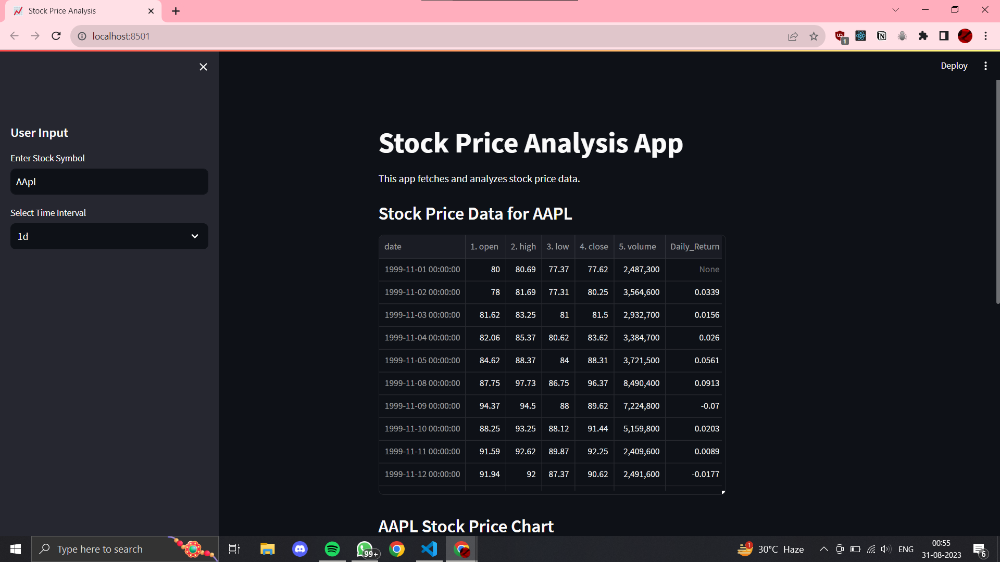

# Stock Analyzer App

The Stock Analyzer App is a web application built with Streamlit that fetches and analyzes stock price data using the Alpha Vantage API. Users can input a stock symbol and select a time interval to view the stock's historical price data and a price chart.

## Features

- Fetch and display historical stock price data.
- Visualize stock price trends with interactive charts.
- Download stock price data and charts for further analysis.

## Getting Started

### Create a project environment (virtual env):
- pip install virtualenv
- py -m venv env

### Activate the environment
- .\env\Scripts\activate

### Deactivate the environment
- deactivate 

### Install prerequisites:
- pip install -r REQUIREMENTS.txt

### Add Vantage API Key
- make a folder named "api.txt"
- paste your api key directly to the above mentioned file

### Run Project:
- streamlit run stock_analyzer_app.py

## Dependencies
- Streamlit
- Alpha Vantage API
- Matplotlib
- Pandas
